<h1 align="center">🌱 ShreeHariAgriTech - Full-Stack E-Commerce Platform</h1>

<p align="center">
  <strong>A comprehensive, high-performance agricultural e-commerce platform built with React.js, PHP, and MySQL.</strong>
</p>

<p align="center">
  
  
  
  
</p>

## 📖 Overview

**ShreeHariAgriTech** is a specialized full-stack e-commerce solution designed to streamline the buying and selling of agricultural products. It features a robust **User Panel** for customers to browse and purchase, a powerful **Admin Dashboard** for complete platform management, and a secure **PHP/MySQL Backend** powering the robust REST API architecture. Integrated with **Razorpay**, it offers a seamless, secure, and intuitive shopping experience.

---

## 🛠️ Tech Stack

- **Frontend (Admin & User):** React.js, React Router, Context API, Axios, CSS
- **Backend & APIs:** PHP 8+, RESTful API architecture
- **Database:** MySQL
- **Payment Gateway:** Razorpay API (Test Mode)

---

## ✨ Key Features

### 👤 User Panel
- **Authentication:** Secure login and registration.
- **Product Discovery:** Browse dynamic product listings, search by categories, and apply advanced filters.
- **Shopping Cart:** Add, remove, and update quantities effortlessly.
- **Checkout & Payments:** Seamless payment processing via Razorpay.
- **Order Management:** Track order history and status.

### 🛡️ Admin Dashboard
- **Analytics & Metrics:** Real-time overview of sales, user growth, and inventory.
- **Product Management:** Add, edit, delete, and categorize products.
- **User Management:** View registered users and manage their access.
- **Order Tracking:** Monitor, update, and manage incoming orders.

### ⚙️ System Level
- **REST APIs:** Scalable and structured PHP backend endpoints.
- **CORS Handling:** Secure data exchange between separated client and server environments.
- **Session Management:** Secure token/session-based state tracking.

---

## 🏗️ Architecture Overview

The system strictly follows a decoupled client-server architecture:
1. **Database:** Operations reside in MySQL (`shreeharidb.sql`), containing structured schemas for users, products, orders, etc.
2. **Backend:** The PHP scripts act as the middleware API. It processes Axios requests from the frontend, queries the MySQL database, and returns JSON responses.
3. **Frontend:** Two distinct React applications (Admin & User) serve the UI, relying completely on the PHP endpoints for data manipulation and Razorpay scripts for checkout.

---

## 📂 Folder Structure

```text
ShreeHariAgriTech/
├── ShreeHari/                     # PHP Backend & REST APIs
├── ShreeHariAdminDashboard-main/  # React.js Admin Dashboard Panel
├── ShreeHariUserPanel-main/       # React.js Customer-Facing User Panel
└── shreeharidb.sql                # MySQL Database Export
```

---

## ⚙️ Installation & Setup Guide

Follow these sequential steps to run the complete environment locally.

### 1. Database Setup
1. Install and start [XAMPP](https://www.apachefriends.org/) or [WAMP].
2. Start the **Apache** and **MySQL** server modules.
3. Open `phpMyAdmin` (usually `http://localhost/phpmyadmin`).
4. Create a new database named `shreeharidb` (or according to the connection string in PHP).
5. Import the `shreeharidb.sql` file provided in the root directory.

### 2. Backend Environment (PHP APIs)
1. Move the `ShreeHari` folder into your local server's public directory:
   - For XAMPP: Move to `C:\xampp\htdocs\ShreeHari`
   - For WAMP: Move to `C:\wamp\www\ShreeHari`
2. Update database connection settings inside your PHP config file (if necessary).
3. Ensure CORS is enabled to accept requests from `localhost:3000` / `localhost:3001`.

### 3. Running Frontend Applications
Ensure you have [Node.js](https://nodejs.org/) installed globally.

**For User Panel:**
```bash
cd ShreeHariUserPanel-main
npm install
npm start
# Runs on typically http://localhost:3000
```

**For Admin Dashboard:**
```bash
cd ShreeHariAdminDashboard-main
npm install
npm start
# Runs on typically http://localhost:3001
```

---

## 💳 Payment Integration Note

The project utilizes **Razorpay** for the checkout flow. Currently, it is configured in **Test Mode**. 
- Dummy cards provided by Razorpay can be used to simulate successful or failed transactions.
- *To deploy for production, replace test API keys with Live keys in the respective configuration files.*

---

## 📸 Screenshots

---

## 🛠️ Admin Panel

<p align="center">
  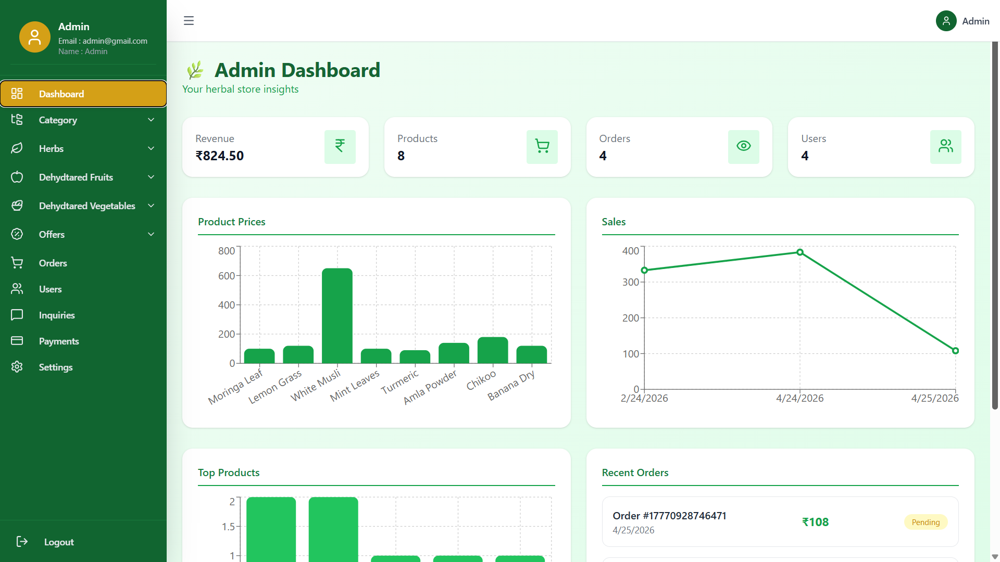
  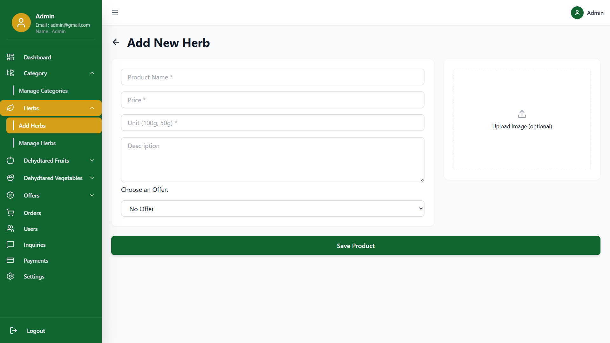
</p>

<p align="center">
  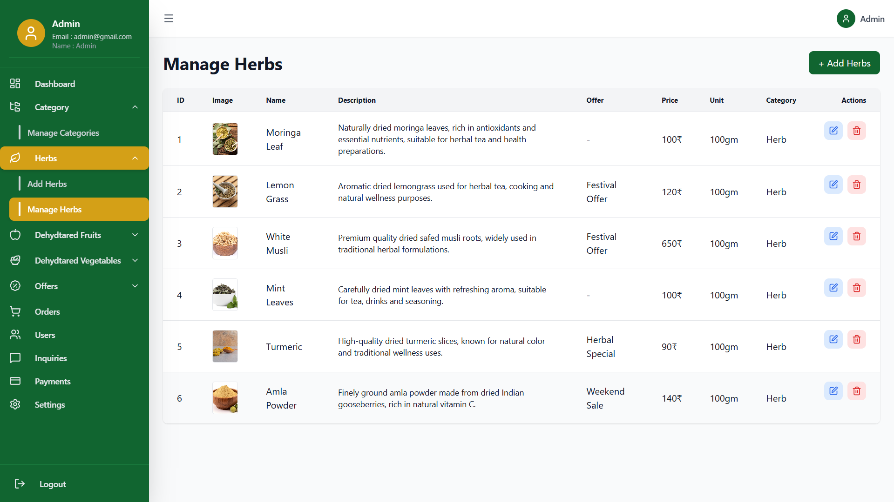
  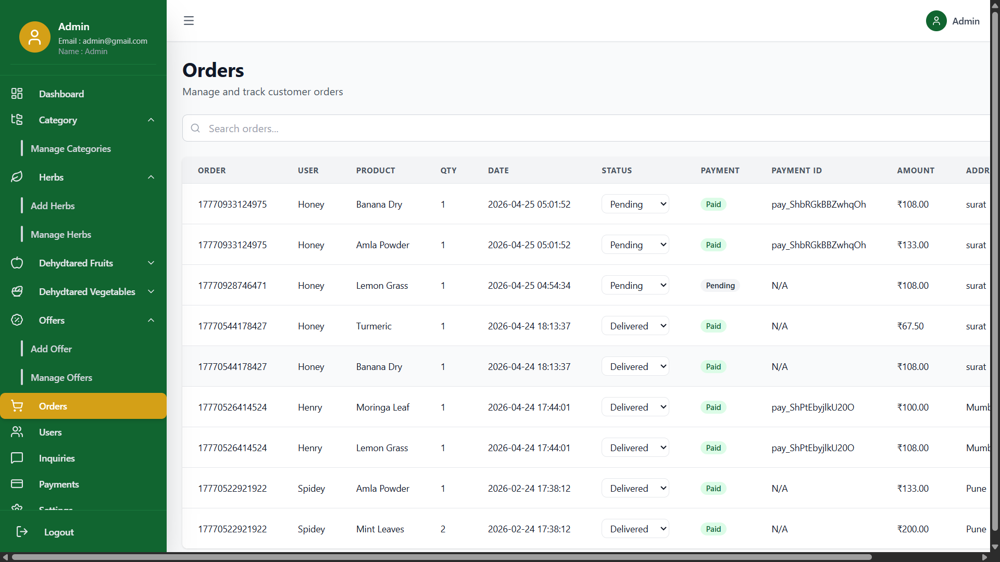
</p>

<p align="center">
  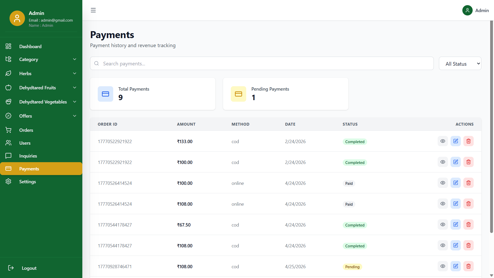
  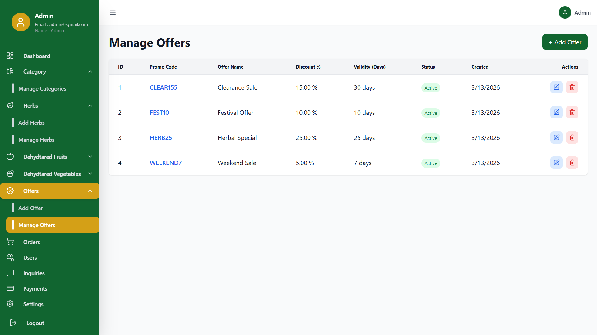
</p>

<p align="center">
  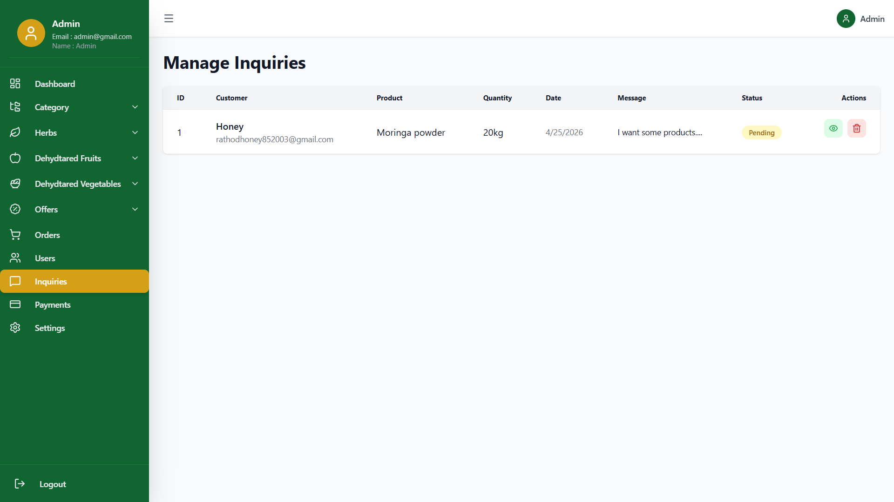
</p>

---

## 👤 User Panel

<p align="center">
  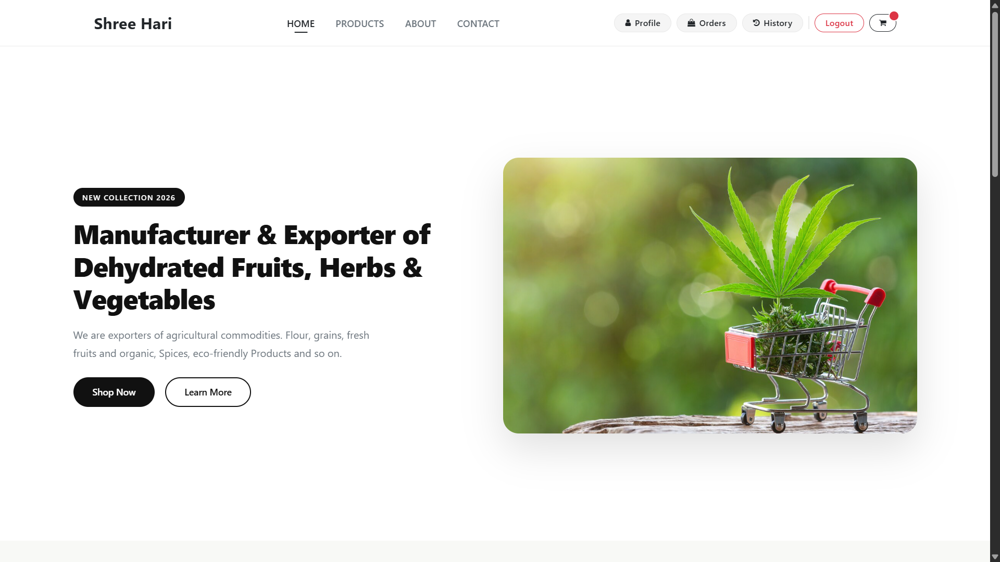
  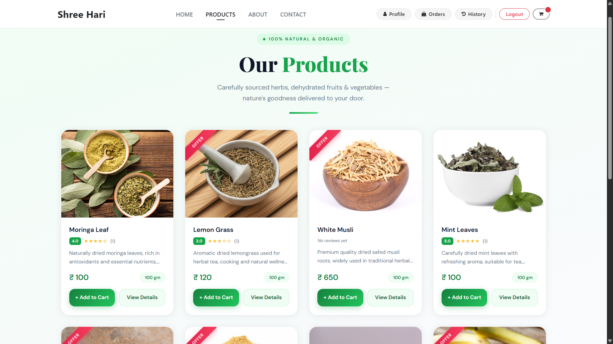
</p>
<p align="center">
  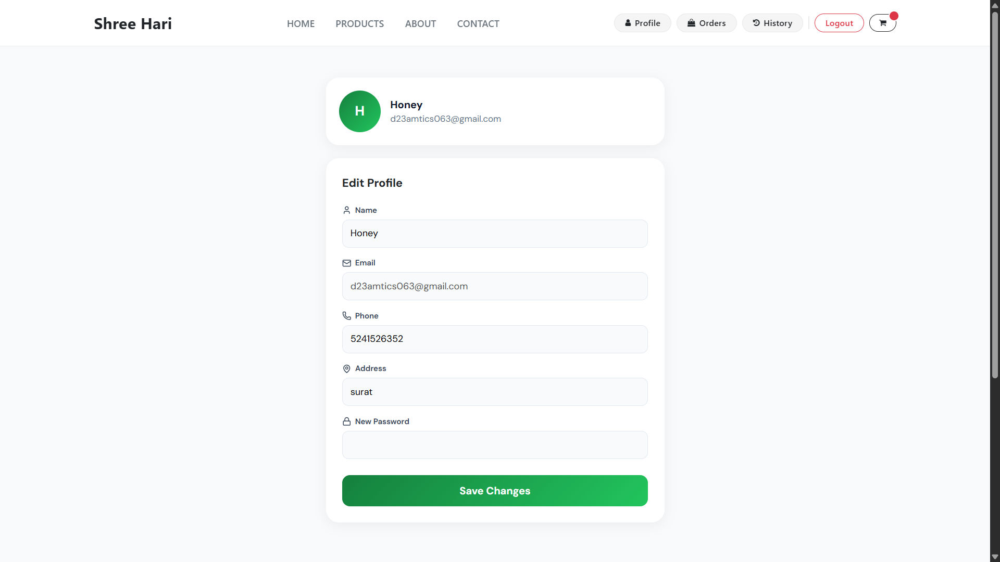
  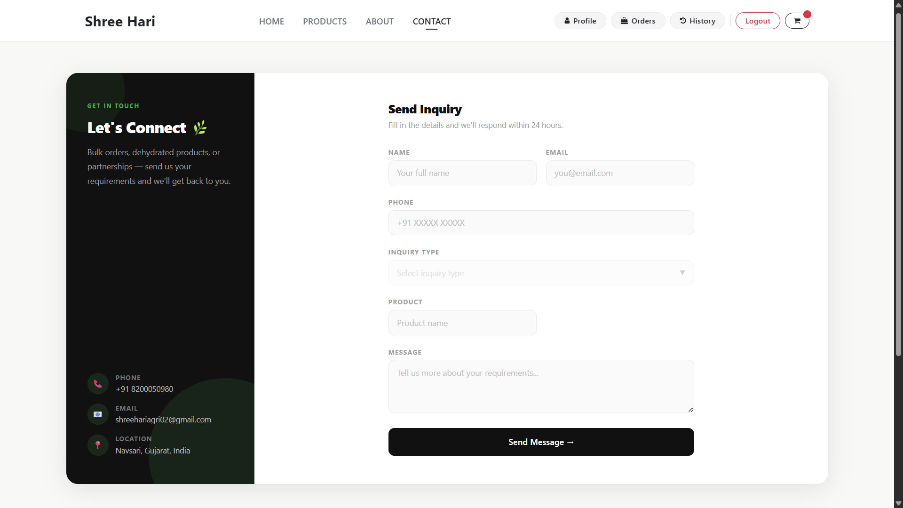
</p>
<p align="center">
  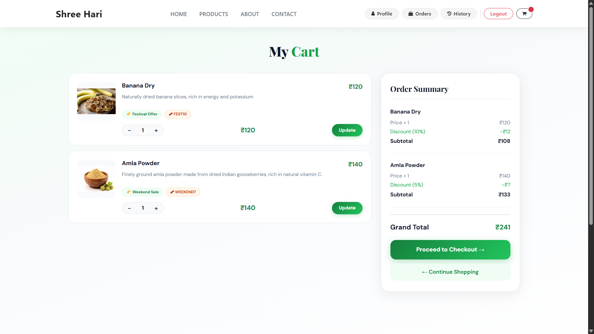
  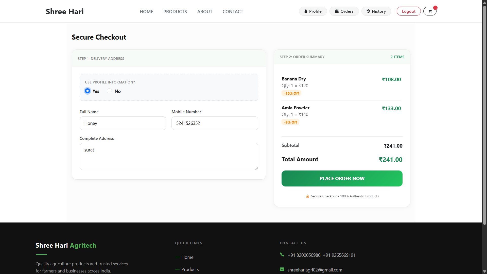
</p>

<p align="center">
  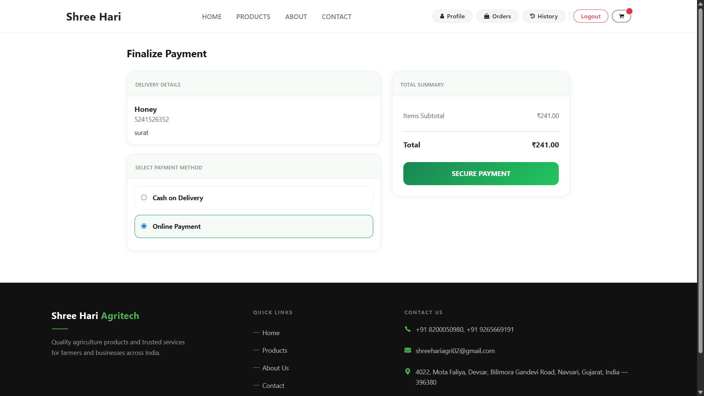
  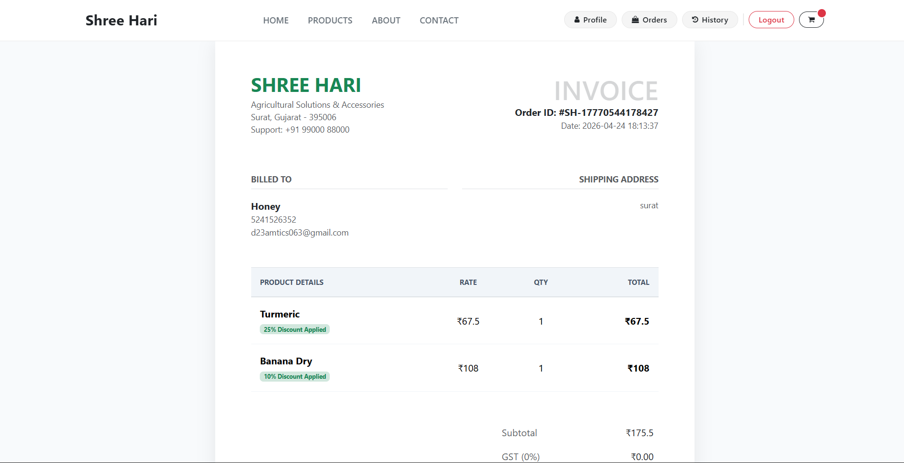
</p>

<p align="center">
  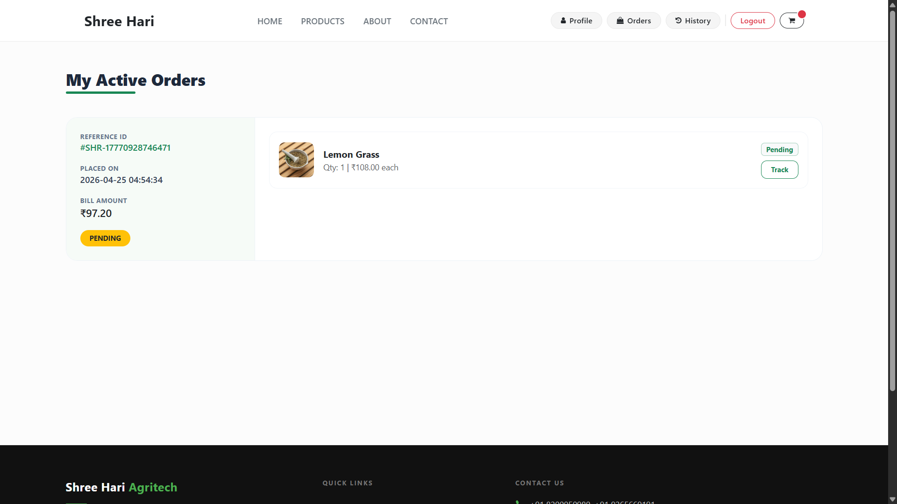
  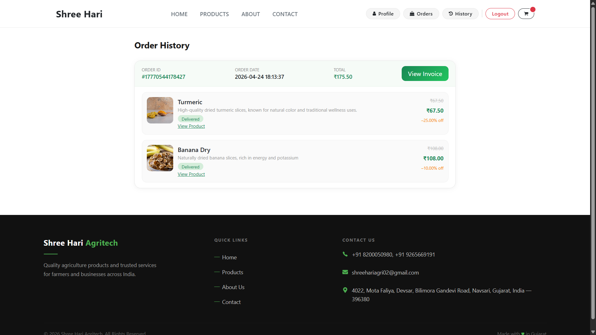
</p>


---

## 🚀 Future Improvements
- **Implement chat support / chatbot integration for instant customer assistance.**
- **Add wishlist & smart cart features with dynamic pricing and offers.**
- **Improve security using JWT authentication, rate limiting, and encrypted APIs.**

---

## 👨‍💻 Author

Built with passion and crafted for scale. Feel free to connect for contributions, questions, or feedback!
